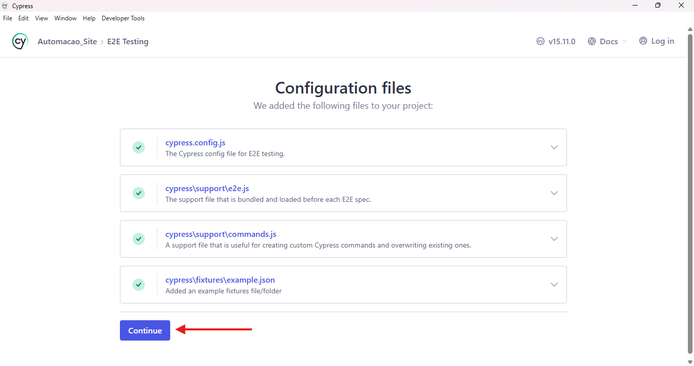
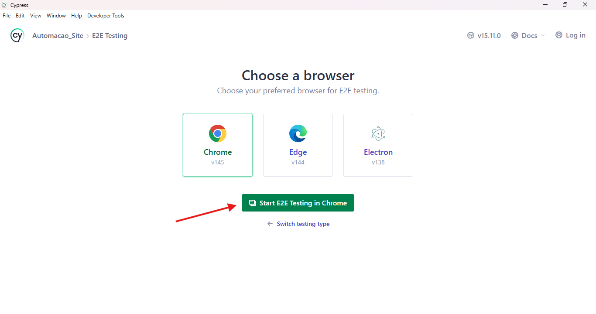
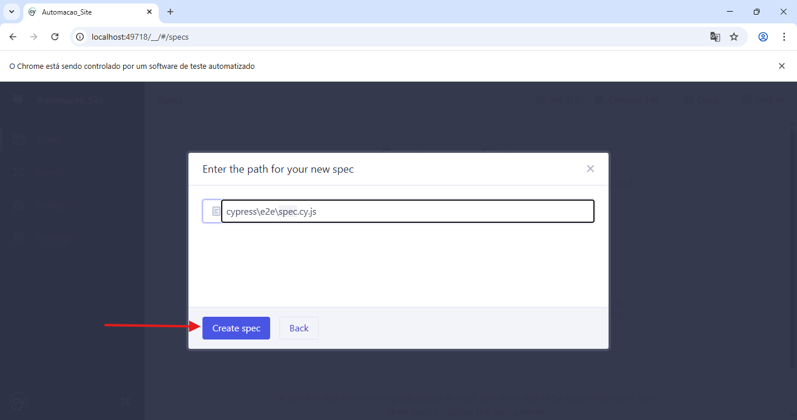
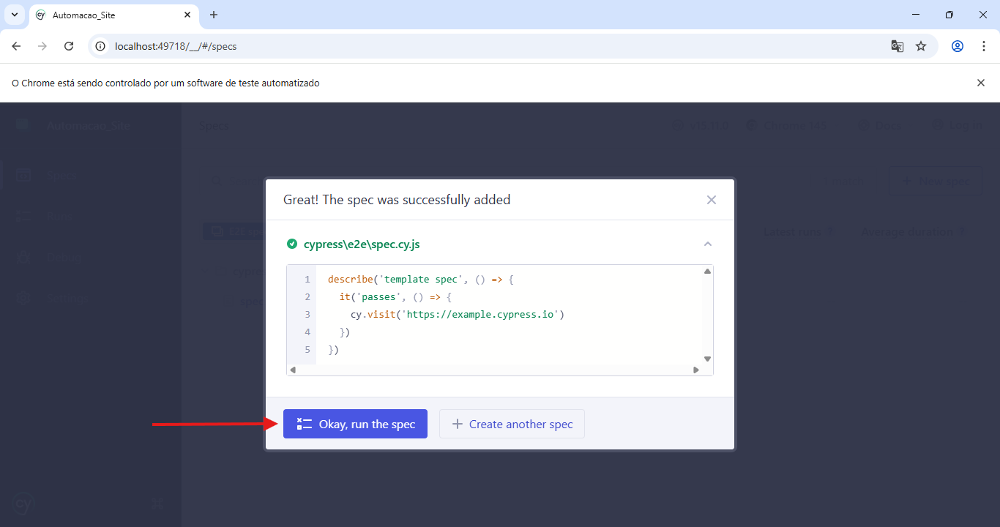

🚀 Automação de Testes - Site de Certificação
Este projeto consiste em uma suíte de testes ponta a ponta (E2E) utilizando Cypress para validar a funcionalidade e a experiência do usuário no site de certificação.

🛠️ Tecnologias e Dependências
Cypress: Framework principal de automação.

Mochawesome: Utilizado para gerar relatórios detalhados em HTML e JSON.

Evidências: Configurado para gravação automática de Vídeos de cada execução.

📦 Instalação
1. Clone o repositório:

git clone https://github.com/Guigoun/Qualidade-Rubeus.git

2. Instale as Dependências do Projeto:
npm install

3. Instale as dependências do Relatório (Mochawesome):

npm install --save-dev mochawesome mochawesome-merge mochawesome-report-generator

🖥️ Guia de Configuração da Interface (Passo a Passo)
Para quem for rodar a automação pela primeira vez na máquina, siga estas instruções visuais:

1. Iniciar o Cypress
Execute npx cypress open e selecione a opção E2E Testing.

2. Validar Arquivos de Suporte
O Cypress mostrará os arquivos de configuração criados. Clique em Continue.

3. Seleção de Navegador
Escolha o navegador de sua preferência (ex: Chrome) e clique em Start E2E Testing.

4. Criar ou Acessar Specs
Se desejar criar um novo teste do zero, selecione Create new spec.

5. Definir o Caminho do Teste
Confirme o local do arquivo dentro da pasta cypress\e2e\.

6. Execução Inicial
Com a spec adicionada, clique em Okay, run the spec para iniciar os testes.

7. Vizualização dos testes
Após clicar em "Run the spec", o Cypress abrirá a janela que possui as pastas com os arquivos dos testes.
Para executar um teste basta clicar em um arquivo de teste.

8. Acompanhamento da Execução
Após selecionar um arquivo de teste o Cypress abrirá a janela de execução. No lado esquerdo, você verá o Log de Comandos (passos que o Cypress está realizando) e, no lado direito, a Visualização em Tempo Real do site sendo testado.
Para executar outros testes, haverá uma aba no canto esquerdo com o ícone de specs, 
basta clicar nele para visualizar os testes.

📂 Organização dos Testes
Os testes foram organizados de forma modular para refletir as diferentes partes do site:

Secao-Inscricao: Validações de preenchimento de formulários.

Secao-OutrosCursos: Testes de cards e botões de navegação.

Secao-Principal: Elementos críticos do topo e corpo da página.

Secao-Rodape: Links institucionais e ícones de redes sociais.

📊 Relatórios e Evidências
Para rodar todos os testes e gerar os relatórios e vídeos automaticamente:

npx cypress run

Relatórios: Verifique a pasta reports/.

Vídeos: As gravações .mp4 ficam na pasta videos/.

Git: Pastas pesadas (node_modules/, reports/, videos/) estão devidamente configuradas no .gitignore para não sobrecarregar o repositório.

🐛 Bugs Identificados Durante a Automação
Durante o desenvolvimento deste projeto, a automação detectou as seguintes falhas críticas:

Erro de Redirecionamento (YouTube): O ícone do YouTube no rodapé está redirecionando incorretamente para uma página do TikTok.

Instabilidade de ID: Elementos das redes sociais possuem IDs dinâmicos que dificultam a seleção estável (Ex: #i2m2tn), sendo necessário o uso de seletores por atributo href para garantir a resiliência do teste.